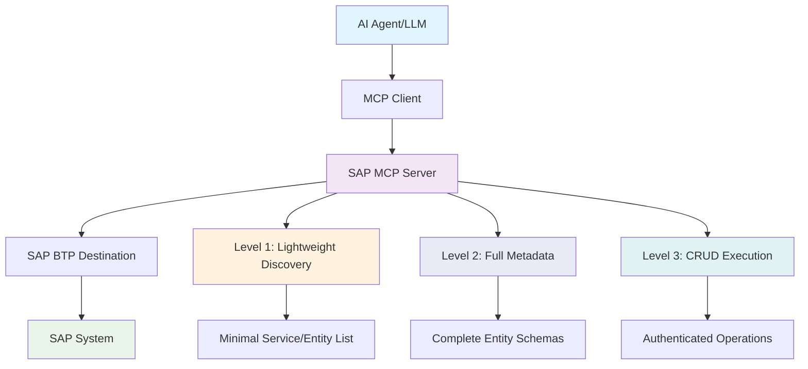

# SAP OData to MCP Server for BTP🚀

## 🎯 **Project Goal**

Transform your SAP S/4HANA or ECC system into a **conversational AI interface** by exposing all OData services as dynamic MCP tools. This enables natural language interactions with your ERP data:

- **"Show me 10 banks"** → Automatically queries the Bank entity with $top=10
- **"Update bank with ID 1 to have street number 5"** → Executes PATCH operation on Bank entity
- **"Create a new customer with name John Doe"** → Performs POST to Customer entity
- **"List all purchase orders from this week"** → Applies $filter for date range on PurchaseOrder entity

## 🏗️ **Architecture Overview - 3-Level Progressive Discovery**



### **Core Components:**

1. **🔍 Level 1 - Discovery**: Lightweight search returning minimal service/entity lists (token-optimized)
2. **📋 Level 2 - Metadata**: Full schema details on-demand for selected entities
3. **⚡ Level 3 - Execution**: Authenticated CRUD operations using metadata from Level 2
4. **🔌 MCP Protocol Layer**: Full compliance with MCP 2025-06-18 specification
5. **🌐 HTTP Transport**: Session-based Streamable HTTP for web applications
6. **🔐 BTP Integration**: Seamless authentication via SAP BTP Destination service

### **3-Level Approach Benefits:**
- **Token Efficient**: Level 1 returns 90% less data than full schemas
- **Progressive Detail**: Fetch full schemas only when needed
- **Better LLM Experience**: Smaller responses, clearer workflow
- **Reduced Context**: From 200+ tools down to just 3

## ✨ **Key Features**

### **🎨 Natural Language to OData**
- **Smart Query Translation**: Converts natural language to proper OData queries
- **Context-Aware Operations**: Understands entity relationships and constraints
- **Parameter Inference**: Automatically maps user intent to tool parameters

### **🔄 Dynamic CRUD Operations**
- **Read Operations**: Entity sets with filtering, sorting, pagination
- **Create Operations**: New entity creation with validation
- **Update Operations**: Partial and full entity updates
- **Delete Operations**: Safe entity deletion with confirmation

### **🚀 Production-Ready**
- **Session Management**: Automatic session creation and cleanup
- **Error Handling**: Comprehensive error handling with user-friendly messages
- **Logging**: Detailed logging for debugging and monitoring
- **Security**: DNS rebinding protection, CORS, Helmet security

### **📊 Real-Time Metadata**
- **Service Catalog**: Live discovery of available services
- **Entity Schemas**: Dynamic schema generation from OData metadata
- **Capability Detection**: Automatic detection of CRUD capabilities per entity

## 🏛️ **System Architecture**

```
┌─────────────────────┐    ┌───────────────────────────┐    ┌─────────────────────┐
│                     │    │                           │    │                     │
│   🤖 AI Agent       │    │   🖥️  SAP MCP Server     │    │   🏢 SAP            │
│   - Claude          │◄──►│   - Service Discovery     │◄──►│   - OData Services  │
│   - GPT-4           │    │   - CRUD Tool Registry    │    │   - Business Logic  │
│   - Local LLMs      │    │   - Session Management    │    │   - Master Data     │
│                     │    │   - BTP Authentication    │    │                     │
└─────────────────────┘    └───────────────────────────┘    └─────────────────────┘
                                           │                                       
                                           ▼                                       
                           ┌───────────────────────────┐                          
                           │                           │                          
                           │   ☁️  SAP BTP Platform    │                          
                           │   - Destination Service   │                          
                           │   - Connectivity Service  │                          
                           │   - XSUAA Security        │                          
                           │                           │                          
                           └───────────────────────────┘                          
```

## 🎯 **Use Cases**

### **📈 Business Intelligence Queries**
```
User: "Show me top 10 customers by revenue this quarter"
→ Tool: r-CustomerService-Customer
→ Parameters: $filter, $orderby, $top
```

### **📝 Data Maintenance**
```
User: "Update supplier ABC123 to have status 'Active'"
→ Tool: u-SupplierService-Supplier
→ Parameters: SupplierId="ABC123", Status="Active"
```

### **📊 Analytical Insights**
```
User: "How many open purchase orders are there?"
→ Tool: r-PurchaseOrderService-PurchaseOrder
→ Parameters: $filter=Status eq 'Open'&$count=true
```

### **🔧 System Administration**
```
User: "List all inactive users in the system"
→ Tool: r-UserService-User
→ Parameters: $filter=Status eq 'Inactive'
```

## 🛠️ **Installation & Setup**

### **Prerequisites**
- Node.js 18.x or higher
- SAP S/4HANA or ECC system with OData services enabled  
- SAP BTP account with Destination and Connectivity services
- TypeScript knowledge for customization

## 🚀 **Usage Examples**

### **Natural Language Queries**

The MCP server automatically translates these natural language commands to the appropriate tool calls:

| **Natural Language** | **Generated Tool Call** | **OData Query** |
|---------------------|------------------------|-----------------|
| "Show me 10 banks" | `r-BankService-Bank` | `GET /BankSet?$top=10` |
| "Find banks in Germany" | `r-BankService-Bank` | `GET /BankSet?$filter=Country eq 'DE'` |
| "Update bank 123 name to ABC Corp" | `u-BankService-Bank` | `PATCH /BankSet('123')` |
| "Create a new customer John Doe" | `c-CustomerService-Customer` | `POST /CustomerSet` |
| "Delete order 456" | `d-OrderService-Order` | `DELETE /OrderSet('456')` |

## 📋 **Available Tools - 3-Level Architecture**

The server exposes **3 progressive discovery tools** instead of hundreds of individual CRUD tools:

### **Level 1: discover-sap-data**
**Purpose**: Lightweight search for services and entities

**Returns**: Minimal data (serviceId, serviceName, entityName, entityCount)

**Usage**:
```javascript
// Search for customer entities
discover-sap-data({ query: "customer" })

// Get all available services
discover-sap-data({ query: "" })

// Search in specific category
discover-sap-data({ query: "sales", category: "sales" })
```

**Fallback**: If no matches found, returns ALL services with entity lists

---

### **Level 2: get-entity-metadata**
**Purpose**: Get complete schema for a specific entity

**Returns**: Full schema with properties, types, keys, capabilities

**Usage**:
```javascript
// Get full schema for Customer entity
get-entity-metadata({
  serviceId: "API_BUSINESS_PARTNER",
  entityName: "Customer"
})
```

**Output**: All properties, types, nullable flags, maxLength, keys, capabilities

---

### **Level 3: execute-sap-operation**
**Purpose**: Perform authenticated CRUD operations

**Operations**: read, read-single, create, update, delete

**Usage**:
```javascript
// Read customers
execute-sap-operation({
  serviceId: "API_BUSINESS_PARTNER",
  entityName: "Customer",
  operation: "read",
  filterString: "CustomerName eq 'ACME'"
})

// Update customer
execute-sap-operation({
  serviceId: "API_BUSINESS_PARTNER",
  entityName: "Customer",
  operation: "update",
  parameters: { CustomerID: "123", CustomerName: "New Name" }
})
```

---

### **Workflow Example**

```
1. discover-sap-data → "customer"
   ↓ Returns: List of customer-related entities

2. get-entity-metadata → "API_BUSINESS_PARTNER", "Customer"
   ↓ Returns: Full schema with all properties

3. execute-sap-operation → read/create/update/delete
   ✓ Executes operation with proper parameters
```
### **Protocol Version**: 2025-06-18
### **Supported Capabilities**:
- ✅ **Tools** with `listChanged` notifications
- ✅ **Resources** with `listChanged` notifications  
- ✅ **Logging** with level control
- ✅ **Session Management** for HTTP transport
- ✅ **Error Handling** with proper error codes

### **Transport Support**

- ✅ **Streamable HTTP** (recommended)
- ✅ **Stdio** for command line usage
- ✅ **Session-based** with automatic cleanup
- ✅ **DNS Rebinding Protection**

## 🔒 **Security & Authentication**

### **SAP BTP Integration**

- Uses BTP Destination service for S/4HANA or ECC authentication
- Supports Principal Propagation and OAuth2
- Automatic token refresh and session management
- Secure credential storage in BTP

### **HTTP Security**

- Helmet.js security headers
- CORS protection with configurable origins
- DNS rebinding attack prevention
- Request rate limiting (configurable)

### **Session Security**

- Automatic session expiration (24h default)
- Secure session ID generation
- Session cleanup on server restart
- Memory leak prevention

## 📚 **API Reference**

### **Health Check**

```http
GET /health
{
  "status": "healthy",
  "activeSessions": 3,
  "discoveredServices": 25,
  "version": "2.0.0"
}
```

### **Server Info**

```http
GET /mcp
{
  "name": "btp-sap-odata-to-mcp-server",
  "protocol": { "version": "2025-06-18" },
  "capabilities": { "tools": {}, "resources": {} },
  "features": ["Dynamic service discovery", "CRUD operations"],
  "activeSessions": 3
}
```

### **Documentation**

```http
GET /docs
{
  "title": "SAP MCP Server API",
  "endpoints": {...},
  "mcpCapabilities": {...},
  "usage": {...}
}
```

## 🎬 Demo

See the MCP server in action:


## ⚙️ Environment Variable: Disable ReadEntity Tool Registration

To disable registration of the ReadEntity tool for all entities in all services, set the following in your `.env` file:

```env
DISABLE_READ_ENTITY_TOOL=true
```
This will prevent registration of the ReadEntity tool for all entities and services.

## ⚡ Quick Start

- For local development and testing, see [LOCAL_RUN.md](./docs/LOCAL_RUN.md)
- For deployment to SAP BTP, see [DEPLOYMENT.md](./docs/DEPLOYMENT.md)
- For VSCode MCP integration with XSUAA OAuth, see [XSUAA_VSCODE_REQUIREMENTS.md](./docs/XSUAA_VSCODE_REQUIREMENTS.md)
